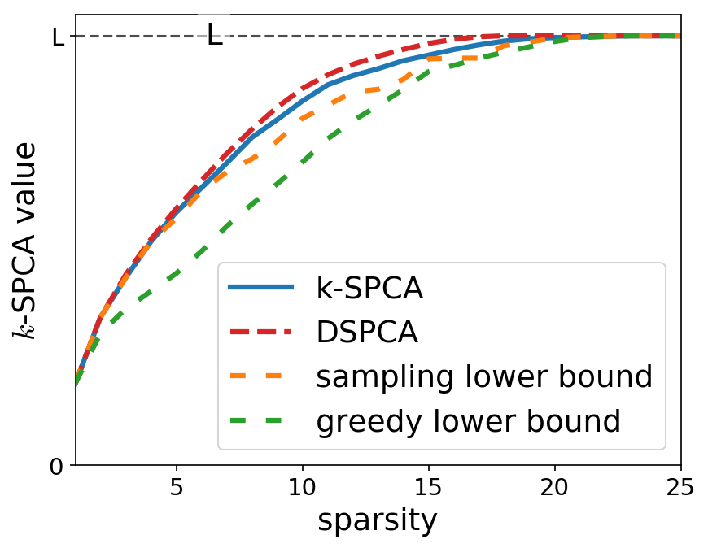

# Sparse PCA

Experimenting with Sparse PCA

## Definition

The sparse PCA is define for a given matrix X in R^{n x p} and an integer k < p as the following optimization problem.

maximize v^TX^TXv such that ||v||_2 <= 1 and ||v||_0 <= k.      (1)

We will denote A = X^TX in the following.
This problem is NP-hard as one need to try all possible support of size smaller than k to solve it exactly. This is what is done with the `brute_force_spca` function.

## Upper bound with DSPCA

The paper by d'Aspremont, Bach and El Ghaoui (2008) [[1][1]] propose a method to compute an upper bound of this value based on a convex relaxation of the problem (1). The convexe relaxation is here directly solved using [`cvxpy`](https://www.cvxpy.org/).

## Sampling lower bound

By definition, the value of the k-SPCA can be lower bounded as the largest singular value of any sub mamatrix X_s composed by the columns of X from set s, as long as the cardinal of the set s is smaller than k. Thus, to compute an lower bound, it is possible to sample supports randomly and take the maximal singular value of all the generated supports.

## Greedy lower bound

In their paper [[2][2]], Moghaddam, Weiss & Avidan propose to compute a greedy lower bound for the sparse PCA. Their algorithm, named GSPCA, inspect a subset of support constructed greedily. The support is initialized to I={} and then grown up to k elements by including in this set the coordinate yielding the best increase for the singular value of the submatrix A_I.

## Comparison

These three bounds can be compare for small problems with the brute force approach. Here are the result for a random matrix of size 25 x 25 and rank 10.

[1]: https://www.di.ens.fr/~aspremon/PDF/OptSPCA.pdf
[2]: https://papers.nips.cc/paper/2780-spectral-bounds-for-sparse-pca-exact-and-greedy-algorithms.pdf
